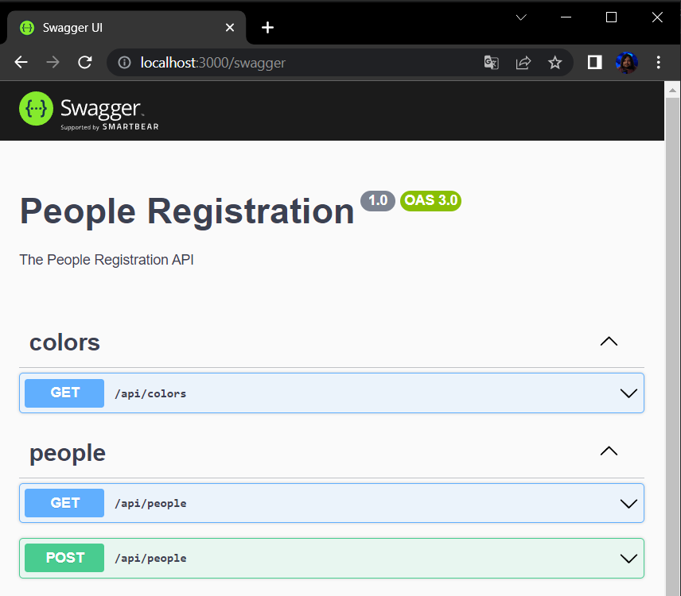
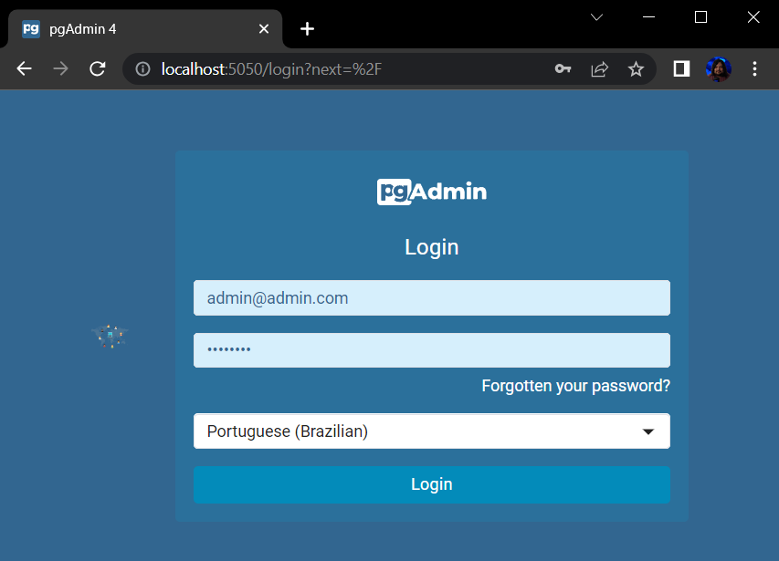
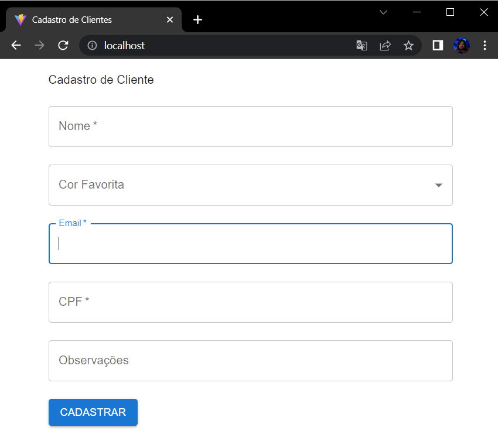

## Challenge Develop customer registration application

Stored fields:

- Full name
- CPF
- email
- comments
- preferred color (among available colors in a rainbow, this may change later)

Mandatory Technologies: Porstgres, Typescript, Node.js, React and Docker

## Prerequisites

- [Docker Desktop](https://docs.docker.com/desktop/)
- [NPM](https://www.npmjs.com/) (optional)

## Getting Started

### Run Development

```
npm run start:dev
```

OR

```
docker compose -f docker-compose.yml up --build
```

### Run Production

```
npm run start:prod
```

OR

```
docker compose -f docker-compose.prod.yml up --build
```

## Links

[http://localhost:3000/swagger](http://localhost:3000/swagger)


[http://localhost:5050](http://localhost:5050)


```
PGADMIN_DEFAULT_EMAIL: admin@admin.com
PGADMIN_DEFAULT_PASSWORD: pgadmin4
-----------------------------------------
DB_NAME=postgres
DB_USER=postgres
DB_PASSWORD=postgres
DB_PORT=5432
```

[http://localhost](http://localhost)

